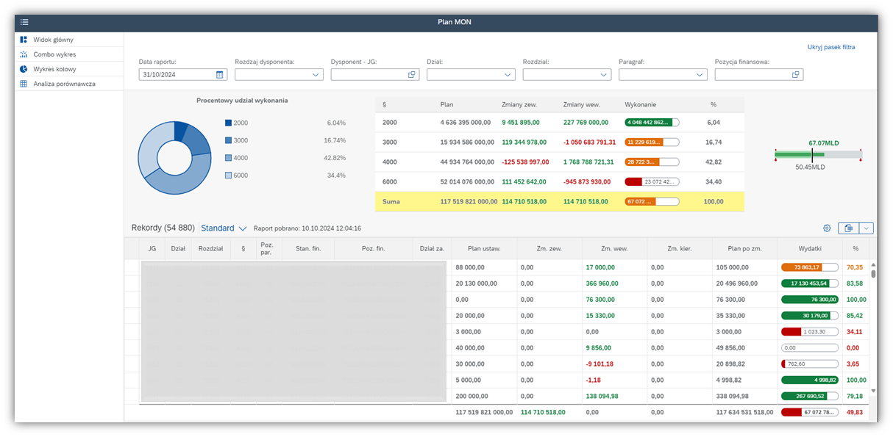
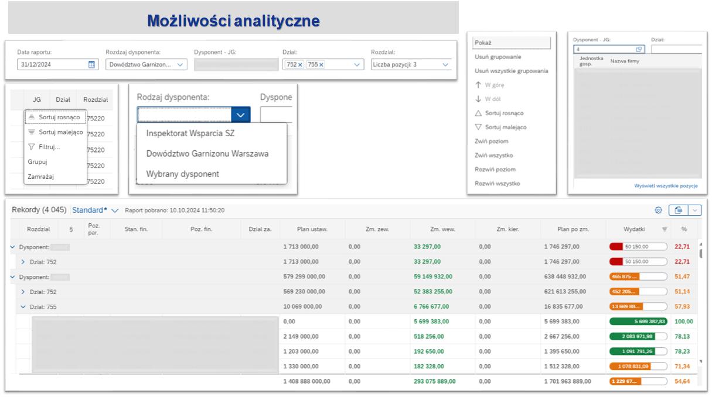

# FiReX – Aplikacja do analizy planu budżetowego MON 🇵🇱 / Budget Analysis App for the Ministry of Defense 🇬🇧

> 🔥 **FiReX = Finance. Reporting. Execution.** 
---

## 🇵🇱 Polski opis

**FiReX** to aplikacja SAPUI5 (freestyle), zaprojektowana do analizy planu budżetowego dla Ministerstwa Obrony Narodowej.

### 🧰 Technologie:
- SAPUI5 (freestyle)
- OData v2 (z SAP backend – poza repozytorium)
- Core Data Services (CDS)
- Analytical Table (`sap.ui.table.AnalyticalTable`)
- VizFrame (`sap.viz.ui5.controls.VizFrame`)
- MicroChart (`sap.suite.ui.microchart`)
  
### 🔍 Kluczowe funkcje:
- Implementacja w SAPUI5 (freestyle)
- Źródło danych: OData v2 z backendu ABAP (kod backendu nie znajduje się w repozytorium)
- Wykorzystanie **analytical table** (CDS) z obsługą:
  - sortowania
  - filtrowania
  - grupowania
  - sumowania (total)
- Intuicyjna kolorystyka i **przejrzysty interfejs użytkownika**
- Słowniki (value helps) podpięte pod filtry
- Dynamiczne wizualizacje danych za pomocą **VizFrame**
- **Analiza porównawcza** dwóch okresów z możliwością „drill-down” do szczegółów
---

## 🇬🇧 English Description

**FIREX** is a SAPUI5 (freestyle) application developed for budget analysis purposes for the Polish Ministry of National Defense.

### 🧰 Technologies:
- SAPUI5 (freestyle)
- OData v2 (SAP backend)
- Core Data Services (CDS)
- Analytical Table (`sap.ui.table.AnalyticalTable`)
- VizFrame (`sap.viz.ui5.controls.VizFrame`)
- MicroChart (`sap.suite.ui.microchart`)

### 🔍 Key Features:
- Built using SAPUI5 (freestyle)
- Data source: OData v2 from SAP backend (ABAP source code not included in this repo)
- Uses an **analytical table** (CDS-based) with support for:
  - sorting
  - filtering
  - grouping
  - totals (sum)
- Intuitive color scheme and **modern, clean UI**
- Value helps (dropdowns) connected to filters
- Interactive data visualizations based on **VizFrame**
- **Comparative analysis** – allows comparison of two periods and **drill-down** into specific data entries
---

## 📸 Zrzuty ekranu / Screenshots

Poniżej kilka widoków aplikacji.  
Below are a few application views.

### 🏠 Strona główna / Homepage

### 🔍 Możliwości analityczne / Analytics operations

### 📊 Wizualizacje danych / Data Visualizations

> 🛡️ Projekt przeznaczony wyłącznie do celów demonstracyjnych.  
> This project is intended for demonstration purposes only.

